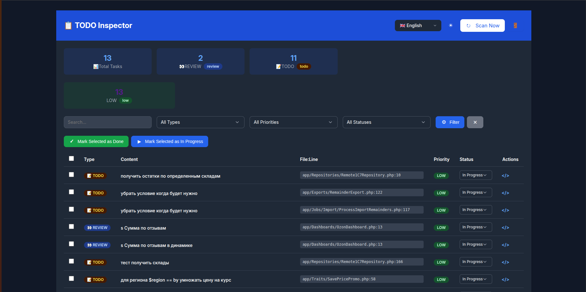

# Laravel Todo Inspector

A powerful Laravel package to scan, manage, and track TODO, FIXME, HACK, REVIEW, and NOTE comments across your entire project. Transform scattered code comments into a manageable technical debt backlog with a beautiful web interface.



## Features

- 🔍 **Smart Scanning** - Detects TODO, FIXME, HACK, REVIEW, NOTE comments in single-line and multi-line formats
- 📊 **Web Interface** - Clean, responsive dashboard with filtering, search, and bulk actions
- 🎨 **Dark/Light Theme** - Automatic theme switching with user preference persistence
- 🌍 **Multi-language** - Support for 9 languages (English, Russian, Ukrainian, Polish, German, French, Spanish, Chinese, Japanese)
- 🔐 **Authentication** - Simple HTTP Basic Auth with configurable credentials
- ⚡ **Bulk Operations** - Update multiple task statuses at once
- 🗂️ **File Links** - Direct links to files in PhpStorm (configurable for other IDEs)
- 📈 **Statistics** - Visual statistics by type, priority, and status
- 🛠️ **Artisan Command** - `php artisan todo:scan` for manual or scheduled scanning

## Requirements

- PHP 8.1 or higher
- Laravel 10.x, 11.x, 12.x, or 13.x
- MySQL, PostgreSQL, or SQLite

## Installation

### 1. Install via Composer

```bash
composer require php-prosvirin-dev/laravel-todo-inspector
```

### 2. Publish Package Assets

Publish everything at once:

```bash
php artisan vendor:publish --provider="Prosvirin\LaravelTodoInspector\TodoInspectorServiceProvider"
```

Or publish individually:

```bash
php artisan vendor:publish --tag=todo-inspector-config      # Configuration
php artisan vendor:publish --tag=todo-inspector-migrations  # Database migrations
php artisan vendor:publish --tag=todo-inspector-views       # Blade templates
php artisan vendor:publish --tag=todo-inspector-lang        # Language files
php artisan vendor:publish --tag=todo-inspector-assets      # CSS/JS assets
```

### 3. Run Migrations

```bash
php artisan migrate
```

### 4. Configure Authentication

Add credentials to your `.env` file to secure the web interface:

```env
TODO_INSPECTOR_LOGIN=admin
TODO_INSPECTOR_PASSWORD=your-secure-password
```

## Configuration

The configuration file is located at `config/todo-inspector.php` after publishing.

### Basic Configuration

```php
return [
    'table_name' => env('TODO_INSPECTOR_TABLE', 'todo_inspector_tasks'),
    'theme' => env('TODO_INSPECTOR_THEME', 'dark'),
    'auth' => [
        'login' => env('TODO_INSPECTOR_LOGIN', 'admin'),
        'password' => env('TODO_INSPECTOR_PASSWORD', 'password'),
    ],
    'locales' => [
        'en' => ['flag' => '🇬🇧', 'name' => 'English'],
        'ru' => ['flag' => '🇷🇺', 'name' => 'Русский'],
        'uk' => ['flag' => '🇺🇦', 'name' => 'Українська'],
        'pl' => ['flag' => '🇵🇱', 'name' => 'Polski'],
        'de' => ['flag' => '🇩🇪', 'name' => 'Deutsch'],
        'fr' => ['flag' => '🇫🇷', 'name' => 'Français'],
        'es' => ['flag' => '🇪🇸', 'name' => 'Español'],
        'zh' => ['flag' => '🇨🇳', 'name' => '中文'],
        'ja' => ['flag' => '🇯🇵', 'name' => '日本語'],
    ],
    'extensions' => ['php', 'js', 'vue', 'blade.php', 'css', 'scss'],
    'exclude_dirs' => ['vendor', 'node_modules', 'storage', 'bootstrap/cache', '.git', 'tests'],
    'exclude_files' => ['test-*.php', '*_test.php', '*.test.php'],
    'github_repo' => env('TODO_INSPECTOR_GITHUB_REPO', null),
];
```

## Usage

Run the scan command to find all TODO comments:

```bash
php artisan todo:scan
```

Options:
- `--clear` - Clear existing tasks before scanning
- `--type=TODO` - Scan only specific type (TODO, FIXME, HACK, REVIEW, NOTE)
- `--path=app/Http` - Scan only specific directory

Example:

```bash
php artisan todo:scan --clear --type=FIXME --path=app/Http
```

## Schedule Automatic Scans

Add to `app/Console/Kernel.php`:

```php
protected function schedule(Schedule $schedule): void
{
    $schedule->command('todo:scan')->dailyAt('03:00');
    // or hourly: $schedule->command('todo:scan')->hourly();
}
```

## Access Web Interface

```
http://your-project.test/todo-inspector
```

Login with credentials configured in `.env`.

## Features in Web Interface

**Dashboard**
- Statistics Cards - Total tasks and breakdown by type
- Priority Statistics - Visual breakdown by priority level
- Click Filters - Click on any statistic card to filter tasks

**Task Management**
- Search - Search across content, file paths, and authors
- Filters - Filter by type, priority, and status
- Bulk Actions - Update multiple tasks at once
- Status Updates - Change task status directly from the table
- File Links - Click the code icon to open the file in PhpStorm

**Theme & Language**
- Dark/Light Mode - Toggle with persistent preference
- Multi-language - Select from 9 languages, saved to localStorage

## Comment Format Examples

The package detects comments in the following formats:

**Single-line Comments**

```php
// TODO: Fix this bug
// FIXME: @username Memory leak here
// HACK: [HIGH] Temporary workaround
// REVIEW: @lead Please check this logic
// NOTE: Important performance consideration
```

**Multi-line Comments**

```php
/**
* TODO: Refactor this method
* FIXME: @developer Edge case not handled
* REVIEW: Architecture decision needed
  */
```

## Priority Tags

Use brackets to specify priority:
- `[LOW]` - Low priority
- `[MEDIUM]` - Medium priority (default)
- `[HIGH]` - High priority
- `[CRITICAL]` - Critical priority

## Author Tags

Use `@username` to assign tasks to specific developers.

## Customization

### Override Views

```bash
php artisan vendor:publish --tag=todo-inspector-views
```

Views will be copied to `resources/views/vendor/todo-inspector/`. Modify them as needed.

### Override Translations

```bash
php artisan vendor:publish --tag=todo-inspector-lang
```

Translations will be copied to `resources/lang/vendor/todo-inspector/`. Add or modify translations.

### Custom CSS/JS

```bash
php artisan vendor:publish --tag=todo-inspector-assets
```

Assets will be copied to `public/vendor/todo-inspector/`. Update CSS or JS files directly.

## Troubleshooting

**Tasks Not Found**
- Check file extensions in config
- Verify exclude directories don't include your code
- Ensure comments match the expected patterns

**Authentication Issues**
- Verify credentials in `.env` file
- Clear config cache: `php artisan config:clear`

**Translation Not Working**
- Publish language files: `php artisan vendor:publish --tag=todo-inspector-lang`
- Clear view cache: `php artisan view:clear`

## Contributing

Contributions are welcome! Please submit a Pull Request or create an Issue.

## License

The MIT License (MIT). Please see [License File](LICENSE) for more information.

## Credits

- Created by [Yauheni Prasviryn](https://github.com/php-prosvirin-dev)
- Built with [Laravel](https://laravel.com) and [Tailwind CSS](https://tailwindcss.com)